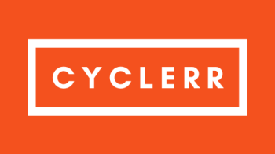

<div align="center">



# 🚴 CYCLERR — Bicycle Rental Management System

### Plataforma inteligente de renta y gestión de bicicletas 🚀

<p align="center">
  <b>CYCLERR</b> es un sistema web dinámico desarrollado para administrar servicios de renta de bicicletas, permitiendo a los usuarios alquilar, extender tiempos de uso y transferir bicicletas entre usuarios mediante una plataforma moderna y eficiente.
</p>

<p align="center">
  
  
  
  
</p>

<p align="center">
  <a href="#-acerca-del-proyecto">Acerca</a> •
  <a href="#-módulos-del-sistema">Módulos</a> •
  <a href="#-características">Características</a> •
  <a href="#-tecnologías-utilizadas">Tecnologías</a> •
  <a href="#-vista-previa">Vista previa</a>
</p>

</div>

---

# 🌌 Acerca del proyecto

**CYCLERR** es un sistema web orientado a la administración de bicicletas de alquiler y movilidad urbana, diseñado para facilitar el préstamo y devolución de bicicletas desde distintas ubicaciones de forma automatizada.

La plataforma permite a los usuarios:

- 🚴 Rentar bicicletas
- 📍 Seleccionar puntos de entrega
- ⏱️ Extender tiempo de uso
- 🔄 Transferir bicicletas a otros usuarios
- 👥 Gestionar cuentas
- 📊 Administrar operaciones
- 🔐 Gestionar accesos
- 🌐 Optimizar movilidad urbana

---

# ✨ Características

## 🚲 Gestión de bicicletas

- 🚴 Registro de bicicletas
- 📍 Gestión de estaciones
- ⚙️ Administración de disponibilidad
- 📋 Información detallada
- 🛠️ Control de mantenimiento

---

## 👥 Gestión de usuarios

- 👤 Registro de clientes
- 🔐 Inicio de sesión
- 📄 Gestión de perfiles
- 📊 Historial de rentas
- ⚡ Administración centralizada

---

## ⏱️ Sistema de renta

- 📅 Reservación de bicicletas
- ⌛ Extensión de tiempo
- 🔄 Transferencia de bicicletas
- 📍 Devolución flexible
- 📋 Gestión de alquileres

---

## 📊 Panel administrativo

- 📈 Dashboard administrativo
- 🚴 Supervisión de bicicletas
- 👥 Gestión de usuarios
- 📅 Administración de reservas
- 🔐 Gestión de permisos

---

# 👨‍💼 Módulos del sistema

## 🚴 Bicycle Module

Este módulo administra las bicicletas registradas dentro del sistema.

### Funcionalidades:

- ➕ Registro de bicicletas
- 📍 Gestión de ubicaciones
- ⚙️ Administración de disponibilidad
- 🛠️ Mantenimiento de bicicletas
- 📋 Información detallada

---

## 👤 User Module

Este módulo es utilizado por los usuarios que desean rentar bicicletas.

### Funcionalidades:

- 🔐 Inicio de sesión
- 🚲 Rentar bicicletas
- ⏱️ Extender tiempo de uso
- 🔄 Transferir bicicletas
- 📄 Consultar historial

---

## 🛠️ Admin Module

Este módulo funciona como administrador principal del sistema.

### Funcionalidades:

- 👥 Gestión de usuarios
- 🚴 Supervisión del sistema
- 📊 Dashboard administrativo
- 📅 Gestión de rentas
- 🔐 Administración de accesos

---

# 🛠️ Tecnologías utilizadas

## 🎨 Frontend

<p>
  
</p>

- HTML5
- CSS3
- JavaScript

---

## ⚙️ Backend

<p>
  
</p>

- JSP
- Java Servlets
- Arquitectura MVC
- Gestión de sesiones

---

## 🗄️ Base de datos

<p>
  
</p>

- MySQL
- Relaciones SQL
- Persistencia de datos
- Gestión de alquileres

---

## 🧰 Herramientas

<p>
  
</p>

- Git
- GitHub
- Visual Studio Code
- XAMPP / WAMP

---

# 📂 Estructura del proyecto

```bash
PlataformaInteligenteRentaBicicletas/
│
├── Assets/                   # Recursos gráficos
├── database/                 # Scripts SQL
├── src/                      # Código fuente Java
├── WebContent/               # Archivos JSP y frontend
├── controllers/              # Servlets y controladores
├── models/                   # Modelos del sistema
├── views/                    # Interfaces JSP
├── login.jsp                 # Inicio de sesión
├── index.jsp                 # Página principal
├── README.md
└── LICENSE
```

---

# ⚡ Instalación

## 📋 Requisitos

- Java JDK 8+
- Apache Tomcat
- MySQL
- XAMPP / WAMP
- Navegador moderno

---

# 🚀 Configuración del proyecto

## 1️⃣ Clonar repositorio

```bash
git clone https://github.com/isairey/PlataformaInteligenteRentaBicicletas.git
```

---

## 2️⃣ Configurar servidor

Iniciar servicios:

```bash
Apache
MySQL
Tomcat
```

---

## 3️⃣ Crear base de datos

Crear base:

```bash
cycle
```

---

## 4️⃣ Importar SQL

Importar:

```bash
PlataformaInteligenteRentaBicicletas/database/cycle.sql
```

---

## 5️⃣ Configurar proyecto

Mover proyecto hacia:

```bash
xampp/htdocs/PlataformaInteligenteRentaBicicletas/
```

---

## 6️⃣ Ejecutar proyecto

Abrir:

```bash
http://localhost/PlataformaInteligenteRentaBicicletas
```

---

# 📊 Funcionalidades principales

## 🚴 Gestión de bicicletas

- Registro de bicicletas
- Administración de disponibilidad
- Gestión de estaciones
- Mantenimiento del sistema

---

## 👥 Administración de usuarios

- Registro y autenticación
- Gestión de perfiles
- Historial de alquileres
- Roles administrativos

---

## ⏱️ Gestión de alquileres

- Reservas en tiempo real
- Extensión de tiempo
- Transferencia de bicicletas
- Control de devoluciones

---

# 📸 Vista previa

## 🖥️ Interfaces del sistema

<div align="center">

### 🚴 Página principal


### 🔐 Inicio de sesión


### 🚲 Gestión de bicicletas


### 📅 Sistema de renta


### 📊 Dashboard administrativo


### 👥 Gestión de usuarios


### 🔄 Cyclerr Pass On


### 📍 Estaciones de bicicletas


</div>

---

# 🧠 Objetivos del proyecto

## 🎯 Aprendizaje y administración

- Desarrollo web Java
- Arquitectura MVC
- Gestión de movilidad urbana
- Bases de datos relacionales
- CRUD administrativos
- Sistemas de autenticación
- Automatización de alquileres

---

# 🚧 Roadmap

## 🔮 Próximas mejoras

- 📱 Aplicación móvil
- ☁️ Infraestructura cloud
- 💳 Pagos electrónicos
- 📍 Geolocalización GPS
- 🚴 Rastreo inteligente
- 🌐 API REST moderna
- 🔔 Notificaciones en tiempo real

---

# 👨‍💻 Contributors
<div align="center">

 <table>
  <tr>
    <td align="center">
      
      <br />
      <sub><b>Dharshini</b></sub>
    </td>

    <td align="center">
      
      <br />
      <sub><b>Sanjitha</b></sub>
    </td>

    <td align="center">
      
      <br />
      <sub><b>Senthil Kumar</b></sub>
    </td>

    <td align="center">
      
      <br />
      <sub><b>Sivasanjay Raahul</b></sub>
    </td>
  </tr>
 </table>

</div>

---

# 🤝 Contribuciones

Las contribuciones son bienvenidas ❤️

## Cómo contribuir

1. Fork del proyecto

```bash
git checkout -b feature/nueva-funcionalidad
```

2. Commit

```bash
git commit -m "✨ Nueva funcionalidad"
```

3. Push

```bash
git push origin feature/nueva-funcionalidad
```

4. Pull Request 🚀

---

# 👨‍💻 Desarrollador

<div align="center">

## Isai Reyes — Full Stack Developer

Desarrollador apasionado por plataformas web, movilidad urbana y sistemas inteligentes 🚀

</div>

---

# 🌟 Apoya el proyecto

⭐ Dale una estrella  
🍴 Haz fork  
📢 Comparte el proyecto

---

# 📜 Licencia

Proyecto open source bajo licencia MIT orientado al aprendizaje y administración de sistemas de renta de bicicletas.

---

<div align="center">

### 🚴 CYCLERR — gestión inteligente de movilidad y alquiler de bicicletas 🚀

</div>
